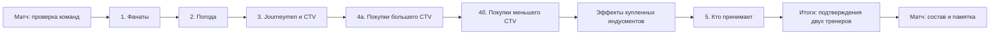

# Пре-матч чеклист Gata Sevens

Дата: 2026-10-05. Статус: реализовано на основном сайте, проверено локально.

## Реализация

Маршрут `#/games/:id/pre-match/:step?` встроен в карточку матча. Пять экранов — фанаты, погода, состав, индусменты, проверка — используют оформление Matchday-билдера, native dialogs, RU/EN и все шесть тем. На сервере действуют права стороны, последовательность покупок, optimistic revision и сброс зависимых этапов при изменении исходного ростера. Старт одной транзакцией сохраняет снимки, временные эффекты и однократные расходы казны; повторный запрос возвращает сохранённый результат.

Уточнения пользователя от 2026-10-06 включены в профиль v2: добор джорнименов до семи добровольный, старт меньшим составом разрешён. Доступны все позиции Lineman, включая Dwarf Blocker Lineman и позиции смешанных команд; позиционные лимиты сохраняются и считают только доступных игроков. Определение подающей/принимающей команды удалено из подготовки. Черновики v1 обновляются с сохранением сделанных выборов и повторным подтверждением сторон; уже начатые матчи сохраняют свои снимки. Весь сайт использует общие визуальные элементы Matchday, включая справочник, команды, игры, сезон и административные экраны.

В профиле v1 зафиксированы предложенные значения: journeymen до 7, максимум 14 игроков, отдельный бонус тира поверх компенсации без изменения очерёдности, Mega-Star весом 2, Stunty-команды перечислены явно в `src/domain/match/rules.mjs`. Медицинские цены берутся из отдельных карточек Gata. Парные звёзды занимают один выбор и два места; профили членов пары берутся из полного справочника, включая страницы без отдельной цены. Метка Mega-Star применяется только при наличии в исходных данных. Наёмники исключены до определения правил их найма в Gata; это объяснено в интерфейсе.

Фактические API: `GET/PATCH /api/games/:id/preparation` (изменения задаются `action.type`), `POST /api/games/:id/start`. База расширена миграцией `005_match_preparation.sql`. Модуль `src/domain/match/*` общий для браузера и сервера.

Проверки: 404 успешных теста, 4 существующих пропуска Windows; `check`, `i18n:check`, `build`; локальный `smoke:pre-match` с конфликтом revisions, изменением ростера, эффектами, конкурентным стартом и повторным списанием. Браузерная проверка двух тренеров, выбора journeymen, каталога/поиска/парных звёзд, молитвы с Primary Skill, подтверждений/старта/листа матча, RU/EN, всех тем, ширин 360/390/768/1440 и закрытия диалогов с возвратом фокуса. Исправлена обнаруженная при проверке ошибка маршрута логотипов: обработанные ответы 404/200/304 теперь останавливают API-диспетчер, ETag использует явный импорт `createHash`, отсутствующий логотип не запрашивается.

Локальный просмотр: порт 3003, сезон `Pre-match preview`, `preview-home` / `preview-away`, пароль `preview2026`. Демо находится на выборе индусментов; исходная казна ещё не списана. Остальные сезоны и команды не изменялись.

Ниже сохранены исследование правил BB2025 и исходный план экранов; актуальная политика Gata v2 перечислена выше и имеет приоритет над исходным планом.

**Решение пользователя:** первая версия предназначена для Gata Sevens; порядок подготовки берём из BB2025, цены, доступ и исключения — из правил нашей лиги.

Цель: из карточки назначенного матча тренер проходит подготовку, собирает временный состав и индусменты в знакомом интерфейсе билдера. После подтверждения обеими сторонами матч получает сохранённый состав, условия и расходы. Вернувшись на страницу, тренер видит, что уже сделано и чей сейчас ход.

## 1. Основа правил

### BB2025: последовательность и экономика

До игры идут пять шагов: фанаты → погода → journeymen → индусменты → определение принимающей команды. Fan Factor = Dedicated Fans + D3; погода определяется суммой D6 двух тренеров. В последнем шаге победитель roll-off выбирает приём или удар. Расстановка и Kick-off Event относятся уже к началу драйва. [The Game of Blood Bowl](https://bloodbowlbase.ru/bb2025/core_rules/the_game_of_blood_bowl/#pre-game-sequence).

Journeymen восполняют нехватку доступных игроков; базовый League Play доводит их до 11. Подходят позиции Lineman с Qty 0–16; временный игрок получает Loner (4+). Их стоимость учитывается до сравнения CTV.

Команда с большим CTV первой покупает индусменты из казны. Вторая получает разницу CTV плюс фактические расходы первой, может добавить из своей казны до 50k. Неиспользованная компенсация сгорает. При равном CTV расходы казны запрещены. [League Play](https://bloodbowlbase.ru/bb2025/core_rules/league_play/#inducements).

Базовый TV исключает казну и Dedicated Fans; CTV дополнительно исключает недоступных игроков. Купленный в ходе сезона реролл имеет обычную оценочную стоимость, хотя заплатить за него приходится вдвое больше. [Drafting a Blood Bowl Team](https://bloodbowlbase.ru/bb2025/core_rules/drafting_a_blood_bowl_team/#team-value).

Индусмент задаёт цену, количество и доступ. Базовые наёмники: до трёх, цена позиции +30k, Loner (4+), один Primary Skill за +50k; позиционный лимит учитывает доступных игроков. Парная звезда занимает один выбор и два места; одинаковая звезда разрешена обеим командам. Звёзды не получают SPP/MVP. Эти сведения нужны для сверки, применение наёмников в Gata требует решения из §3. [Inducements](https://bloodbowlbase.ru/bb2025/core_rules/inducements/).

### Переопределения Gata

Авторитетные локальные материалы для первой версии:

- [All Gata Changes](../../../content/Gata/General%20Information/All%20Gata%20Changes.md): бонусы тиров, исключение тренеров и чирлидеров из TV, Mega-Star, покупаемые в ростер взятки.
- [Special Rules](../../../content/Gata/General%20Information/Special%20Rules.md): Low Cost Linemen, доступ к медицинским индусментам, Team Captain.
- [Карточки индусментов](../../../content/Gata/Inducements): текущие цены, лимиты, эффекты и ограничения.
- [Weather](../../../content/Gata/General%20Information/Weather.md): отдельные таблицы Spring, Summer и Autumn.
- [Prayers to Nuffle](../../../content/Gata/General%20Information/Prayers%20to%20Nuffle.md): таблица эффектов нашей лиги.
- [Team Creation](../../../content/Gata/Rules/2.%20Team%20Creation.md), [Patch Notes](../../../content/Gata/Rules/5.%20Patch%20Notes.md), [league-rules.mjs](../../../src/domain/league-rules.mjs): формат Sevens, максимум 14 игроков, текущий минимум ростера 7.

Конкретные правила, которые уже явно записаны:

| Область | Gata |
|---|---|
| Бонус тира | Tier 2 против Tier 1: 200k; Tier 3 против Premier: 300k; Tier 3 против Tier 2: 100k. Способ сочетания с CTV ещё не определён явно |
| Low Cost Linemen | Нулевая hiring fee линейных игроков в CTV; повышения стоимости сохраняются |
| Персонал в TV | Assistant Coaches и Cheerleaders не учитываются |
| Звёзды | 2 выбора, 4 для Stunty Leagues; звёзды из выбранной лиги; Mega-Star занимает оба обычных слота |
| Постоянные взятки | Bribery and Corruption: до 3 за 50k, включаются в TV |
| Молитвы | 0–3 за 15k; локальная карточка разрешает переброс уже выпавшего результата |
| Погода | Таблицу выбирает профиль матча; она не определяется автоматически по реальному месяцу |

Не переносить в Gata значения 11/16 игроков, 10k за молитву или базовый лимит 6 взяток для Bribery and Corruption.

## 2. Что есть в приложении

План опирается на текущую рабочую копию, включая новый Matchday-интерфейс билдера и сохранённого ростера.

| Точка | Наблюдение и следствие |
|---|---|
| `src/screens/builder.mjs`, `saved-roster.mjs` | Оба экрана используют Matchday-каркас; это визуальная основа подготовки |
| `src/components/roster-editor/matchday-layout.mjs` | Шапка команды, полоса показателей, основная область, сводка, мобильная нижняя панель и native dialog выбора |
| `src/components/roster-editor/hire-panel.mjs` | Карточка позиции, пять характеристик, ссылки навыков, цена, объяснение недоступного выбора |
| `src/styles/matchday.css` | Общие цвета тем, прямые рамки, крупные заголовки, моноширинные числа; sidebar от 1200px, диалог по центру от 601px |
| `src/domain/roster/costs.mjs` | `calculateRosterCosts()` уже исключает `skipNextGame`, но включает Assistant Coaches/Cheerleaders и оценивает `teamRerolls` по удвоенной покупной цене. Low Cost Linemen не применён. Результат нельзя напрямую использовать как CTV |
| `src/domain/roster/schema.mjs` | Казна, постоянный персонал, капитан и MNG есть; подготовки и временных наймов нет |
| `src/screens/leagues.mjs` | Есть сопоставление доступности звёзд по лиге; вынести его из UI в общий домен и заменить разбор текста структурированными данными |
| `scripts/build-data.mjs` | Команды и звёзды получают метаданные; индусменты пока остаются справочными страницами без пригодной для покупок схемы |
| `src/screens/games/game.mjs` | Сейчас есть команды и отправка/подтверждение результата; индивидуального начала матча нет |
| `server/season/store.mjs`, `server/api/serializers.mjs` | API матча не возвращает оба полных ростера и их revisions; понадобится расширение |
| `server/db/migrations/001_baseline.sql` | Pairing хранит результат; подготовки, снимков состава и расходов нет |

Новая функция получает самостоятельный домен подготовки. Повторно используем визуальные примитивы; покупку временного игрока не проводим через обработчик постоянного найма, который сразу меняет казну и ростер.

## 3. Решения о правилах перед реализацией

Это вопросы к профилю Gata, а не запрос на подтверждение плана. UX и хранение можно проектировать сейчас; автоматический расчёт спорных случаев выпускается после фиксации трактовок.

| Вопрос | Что известно | Предлагаемая трактовка / нужное решение |
|---|---|---|
| До какого числа добавлять journeymen? | В core — 11; в проекте Sevens и минимум 7, явного правила восполнения нет | Принять `journeymanTarget=7`. Подтвердить это как правило Gata; исключение для позиции без Qty 0–16 не додумывать |
| Как применять бонус тира? | Записаны суммы, нет формулы и связи с очерёдностью | Рекомендация: отдельный бонус указанной команде поверх компенсации, без изменения CTV/очерёдности и без компенсации этого бонуса сопернику. Проверить сценарии, где бонус получает команда с большим или равным CTV. Уточнить, означает ли Premier именно Tier 1 |
| Stunty и Mega-Star | Есть 4 выбора для Stunty Leagues и формулировка «оба слота» для Mega-Star | Зафиксировать список Stunty Leagues; уточнить вес Mega-Star при лимите 4. Не выводить Stunty из тира либо наличия одного игрока с Stunty |
| «Ignoring team limits» у звёзд | Формулировка не уточняет, речь об ограничениях доступности или вместимости | Предлагаем доступ по выбранной лиге и обычную вместимость 14; исключение общего размера ростера для звёзд должно быть записано отдельно |
| Наёмники | Есть в core, отдельной карточки Gata нет; Patch Notes удаляют Free Agent | Решить, разрешены ли именно Mercenary Players. Не считать Free Agent синонимом. По умолчанию не показывать покупку до включения в профиль |
| Медики и взятки | Общие изменения указывают 50k за некоторых медиков, карточки — 100k. Постоянные и матчевые взятки описаны раздельно | Утвердить цены. Для взяток определить общий/раздельный лимит с постоянными и влияние матчевой покупки на TV; исключить двойной учёт |
| Прочие расхождения каталога | Biased Referee есть карточкой, но запрещён общими правилами; Giant заявлен в Patch Notes без отдельной карточки; запрет касается Special Hired Wizards, обычный Hired Wizard перечислен | Biased Referee отключить по запрету. Обычный Hired Wizard оставить по явной карточке. Giant не продавать до появления цены, доступа и профиля |
| Погода и молитвы | Для погоды есть 2D6/D6-колонки, Winter отсутствует; Gata говорит «may reroll» повтор молитвы | Первая версия: явный weather table и броски D6 двух тренеров. Не добавлять Winter и не требовать обязательного переброса дубля молитвы без уточнения |

Итог фиксируется как версия `gata-sevens` с параметрами и источниками. Отдельный режим обычного BB2025 в первую версию не входит.

## 4. Сценарий и экраны

Вход: «Мои игры» → назначенный матч → **«Подготовка к матчу»**. Новый маршрут — `#/games/:id/pre-match/:step`; возврат ведёт в `#/games/:id`. В сохранённой команде можно дать вторую ссылку на её текущий матч. Выбирать заново расу или соперника не нужно: обе команды уже определены pairing.

Нулевая проверка данных предшествует официальным пяти шагам. Отдельный экран итогов завершает их. Неприменимый шаг получает статус «Не требуется», оставаясь видимым в последовательности.



При равном CTV применяется отдельная ветка правил, а не произвольное назначение «первого покупателя». Эффекты индусментов — подэтап четвёртого шага, а не дополнительный шаг core rules.

| Экран | Содержание и выбор | Условие завершения |
|---|---|---|
| Проверка команд | Обе команды, revisions, доступные/MNG, капитан, лига звёзд, постоянный персонал, профиль правил. Ссылка в редактор при ошибке | Данные загрузились; блокирующие нарушения устранены. После изменения ростера его проверяют заново |
| 1. Фанаты | Две карточки: Dedicated Fans, введённый D3, рассчитанный Fan Factor | Оба значения корректны. Подписи отличают постоянных фанатов от Fan Factor конкретного матча |
| 2. Погода | Таблица Gata, D6 каждого тренера, сумма, название и краткий эффект | Оба броска введены; общий результат сохранён |
| 3. Состав | Основные игроки, MNG отдельной свёрнутой группой, временные линейные игроки, детализация CTV | Обе стороны подтвердили состав. Если доступных игроков достаточно, найм не предлагается |
| 4. Индусменты | Очерёдность, источники бюджета, категории, карточки выбора, корзина | Первая фаза зафиксирована до второй; затем обе корзины подтверждены |
| 4. Эффекты | Только нужные купленным позициям поля: молитвы, их цели/навыки, Mark of Chaos, Rowdy Rookies | Все эффекты «до игры» разрешены. Эффекты начала драйва/тайма остаются в памятке |
| 5. Приём/удар | D6 обоих тренеров, ничья требует нового roll-off; победитель выбирает «Принимать» или «Бить» | Есть победитель и его выбор. Home/Away не означает kicking/receiving |
| Итоги | Составы, Fan Factor, погода, CTV, бюджет, покупки, расходы казны, временные эффекты и статусы двух подтверждений | Обе стороны подтвердили одну и ту же версию; транзакция начала игры прошла |

### Общий каркас

Сохранить оболочку сайта и активный раздел «Мои игры». Под ней — `page-head` с возвратом в матч, компактная Matchday-шапка своей команды с соперником и номером стола. Не помещать две полноразмерные шапки подряд.

Полоса показателей меняется по этапу: на составе — «Доступно», «CTV», «Казна»; на покупках — «На индусменты», «Выбрано», «Осталось». Казна и бюджет индусментов никогда не подписаны одним словом «Бюджет».

Шаги обозначаются текстом и состояниями: выполнен, текущий, ожидает соперника, не требуется. Завершённый шаг доступен для просмотра. Переход вперёд не обходит зависимые проверки. Возврат к редактированию показывает, какие последующие подтверждения будут сброшены.

### Выбор journeymen

- Доступный основной состав показан карточками текущего билдера: номер, имя, позиция, характеристики, ссылки навыков, капитан. Постоянные SPP и улучшения здесь доступны для просмотра.
- Отдельная строка: «Доступно 5 / требуется 7 — добавить 2 временных игроков»; это пример для предлагаемого профиля Sevens.
- Кнопка **«Добавить journeyman»** открывает знакомый диалог найма, отфильтрованный по разрешённым линейным позициям. Одна позиция может быть предвыбрана; при нескольких пользователь выбирает тип каждого игрока.
- Карточка временного игрока содержит метки «На этот матч» и `Loner (4+)`, изменение CTV, кнопки добавления/удаления. Найм не оплачивается из казны. Для Low Cost Linemen явно показываем «В CTV: 0k».
- Номер временного игрока не конфликтует с номерами постоянного состава, в том числе MNG. Личные навыки и контракт основной команды к новому journeyman не копируются.
- При достаточном составе: «Journeymen не требуются» и обычная кнопка продолжения. Число игроков для будущей расстановки не превращаем в произвольный выбор семи из всей скамейки.

### Выбор индусментов

Основной экран содержит корзину матча, а каталог открывается кнопкой **«Добавить индусмент»** в диалоге того же типа, что «Добавить игрока» в билдере. Категории: **«Персонал и помощь»**, **«Звёзды»**, **«Наёмники»** — последняя только при разрешении профилем.

Для небольших повторяемых покупок используется знакомый счётчик `− / количество / +`. Карточка показывает имя, цену после скидки, выбранное/максимальное количество, короткий эффект и ссылку «Правило». Недоступная покупка объясняет причину рядом: «Не хватает 20k», «Нужен Favoured of Nurgle», «Достигнут лимит».

По умолчанию каталог показывает разрешённое команде. Переключатель «Показать недоступные» позволяет понять ограничения. Бюджет не скрывает дорогую разрешённую позицию, а объясняет нехватку средств. При нулевом бюджете экран предлагает **«Продолжить без индусментов»**.

На этапе первой команды вторая видит «Ожидаем выбор соперника». Её будущая сумма отмечена как предварительная, покупка недоступна. После фиксации расходов первой сумма становится окончательной. Возобновить редактирование первой корзины можно до начала матча, с явным сбросом зависимых выборов и подтверждений второй.

### Звёзды, пары и наёмники

Карточка звезды повторяет карточку игрока: характеристики, навыки-ссылки, специальная способность, цена, лига, метка Mega-Star и расход слотов. В выбранном составе звезда помечена «На этот матч».

Парные звёзды продаются одним пакетом: общая цена и расход выборов задаются метаданными, показываются обе карточки игроков. Например, в текущих данных Grak имеет цену и требование пары, а у Crumbleberry цена отсутствует: нельзя превращать его в самостоятельную бесплатную покупку. Добавление/удаление пары атомарно.

Для разрешённого наёмника: выбор позиции → просмотр базового профиля и полной цены → необязательный выбор одного допустимого Primary Skill → добавление в корзину. Используем существующие названия категорий навыков и ссылки; цена и временный Loner видны до подтверждения.

Раздельно показываем **места в составе** и **выборы звёзд**. Не запрещаем одинаковую звезду двум соперникам по правилам старой редакции. Внутри одной команды повтор одного и того же пакета запрещён.

### Разрешение эффектов

Форма генерируется из купленных позиций; пустых необязательных шагов нет.

| Покупка | Что ввести сейчас | Что показать в памятке |
|---|---|---|
| Nuffle's Prayers | D16 для каждой молитвы; затем цели и навык только если нужны. Случайную цель записываем как результат настольного выбора | Эффект и срок, включая модификации получения SPP |
| Mark of Chaos | Игрок без статуса Star Player; набор навыков по уже выбранному Favoured | Временные навыки до конца матча |
| Rowdy Rookies | Два D3; количество `2D3+1`; допустимые временные линейные игроки | Дополнительный состав и исключение вместимости |
| Chef, Rune Priest, Grape Day, Drummer | Добавить ресурс/напоминание, без преждевременного розыгрыша | Когда применять: начало тайма/драйва и другие триггеры карточки |
| Bribe, Wizard, медики | Число доступных использований | Когда разрешено использовать и какой эффект |

Броски первой версии вводятся вручную для настольной игры. Кнопка цифрового броска не является зависимостью выпуска. Изменения результатов сохраняют автора и историю; «случайно выбрать игрока» не подменяется свободным выбором подходящей цели.

Временные навыки/характеристики хранятся как эффекты матча. Они не попадают в `extraSkills`, advancements, постоянную стоимость и SPP основного ростера.

## 5. Эскизы компоновки

### Desktop: индусменты

```text
Подготовка к матчу                         Вернуться к матчу
[герб] DRUNKEN RUNE GUARD · против команды B · стол 3
Фанаты ✓   Погода ✓   Состав ✓   Индусменты 4/5   Приём/удар
┌─────────────────┬──────────────────┬──────────────────┐
│ На индусменты   │ Выбрано          │ Осталось         │
│ 170k            │ 125k             │ 45k              │
└─────────────────┴──────────────────┴──────────────────┘
                                                      СВОДКА
ИНДУСМЕНТЫ.              [+ Добавить индусмент]        CTV: 720k / 850k
                                                      Компенсация   170k
[ Team Mascot       25k       −  1  + ]                Бонус тира      0k
[ Bloodweiser Keg   40k       −  1  + ]                Из казны         0k
[ Vishnevsky       60k       −  1  + ]                Выбрано        125k
                                                      Сгорит          45k
Правило / пояснение под каждой покупкой               Казна: 80k → 80k
                                                      [Подтвердить выбор]
```

Пример: соперник с CTV 850k уже потратил 40k казны; при CTV 720k компенсация 170k. Наши покупки 125k полностью покрываются компенсацией; остаток 45k сгорит. Доплата не нужна, казна остаётся 80k. Если покупки вырастут до 185k, необходимая доплата составит 15k.

### Диалог выбора

```text
Добавить индусмент                   Доступно 45k   [×]
[Персонал и помощь] [Звёзды] [Наёмники, если разрешены]
[Поиск по имени]                     [Недоступные ☐]

┌──────────────────────┐  ┌──────────────────────┐
│ Weather Mage    20k  │  │ Nuffle's Prayers 15k │
│ 0 / 1                │  │ 0 / 3                │
│ Краткий эффект       │  │ Краткий эффект       │
│ [Правило]   [− 0 +]  │  │ [Правило]   [− 0 +]  │
└──────────────────────┘  └──────────────────────┘
```

### Mobile: тот же этап

```text
← Подготовка
[герб] Команда · против B
Шаг 4 из 5 · Индусменты
[Сводка матча ▾]
На индусменты 170k   Выбрано 125k

[Team Mascot        25k     − 1 +]
[Bloodweiser Keg    40k     − 1 +]
[Vishnevsky         60k     − 1 +]
[+ Добавить индусмент]

──────── закреплённая нижняя панель ────────
Осталось 45k              [Подтвердить выбор]
```

До 600px — один столбец, диалог выбора снизу, сводка сворачивается над контентом. На 601–1199px — центрированный диалог и сводка в потоке. От 1200px — основная область и sidebar около 265px. Нижняя панель содержит итог и одно основное действие; контент получает отступ с учётом safe area.

Все поверхности используют текущие theme tokens. Полоса показателей переносится при недостатке места; длинные русские названия не вызывают горизонтальный скролл страницы. Минимальный размер действия — 44px; блокировка доступна через `aria-disabled` с объяснением, закрытие диалога возвращает фокус. Статус выражен текстом, не только цветом. RU/EN проходят через `t()`.

## 6. Расчёты и инварианты

### CTV

Добавить чистую функцию `calculateMatchCtv(team, roster, journeymen, rules)` с детализацией для UI. Отделить её от стоимости создания команды и движения казны.

Она учитывает доступность, индивидуальную стоимость игрока, Low Cost Linemen, постоянный персонал и базовую оценку рероллов. Для Gata исключает тренеров/чирлидеров, фанатов, казну и Coach's Safe. Постоянные взятки учитываются по принятому правилу. Базовые journeymen входят до сравнения; новые покупки четвёртого шага не запускают повторный расчёт компенсации, если профиль явно не задаёт особое правило.

Сохранить два независимых числа: все постоянные игроки и доступные на матч. Проверять вместимость по правилу конкретного найма, не подставлять повсюду `totalPlayersCount`; поведение постоянного редактора этим планом не переопределяется.

### Бюджет

Внутренние денежные единицы — целые `k`, как в текущем проекте; UI показывает `k`, данные источников в gold pieces преобразуются на границе.

Храним `ctvDifference`, `opponentTreasurySpend`, `tierAllowance`, `treasuryContribution`, `selectedCost`, `pettyCashUsed`, `tierAllowanceUsed`, `treasuryUsed` и неиспользованные суммы. Калькулятор объясняет каждую составляющую.

Доплата — явно выбранная часть собственных денег, которая действительно оплачивает покупки. Предвыбор — минимально необходимая доплата; предел применяется по профилю и доступной казне. При удалении покупки лишняя ещё не потраченная доплата уменьшается. Нельзя записать в расход всю заданную «максимальную доплату», если корзина дешевле.

Примеры для принятия калькулятора: разные CTV без расходов первой стороны; с её расходами; равные CTV; доплата 0/50k; казна меньше разрешённой доплаты; бонус тира при большем/равном/меньшем CTV. Для Gata ожидаемые суммы фиксируются после решения §3.

Позиционный лимит, вместимость временного состава, выборы звёзд, скидка и доступ проверяются независимо. Исключение Rowdy Rookies не становится универсальным способом обойти лимиты любой другой покупки.

## 7. Состояние матча и сохранение

Подготовка хранится на сервере и восстанавливается с другого устройства. Браузерный черновик может дополнять её, но не определяет готовность матча.

Разделить текущий `resultStatus` и новый `preparationStatus`:

```text
not_started → preparing → ready → in_progress
```

Внутри `preparing` сервер ведёт этап и сторону, имеющую право покупать. `ready` означает совпавшие подтверждения обеих сторон. Начало тура в администрации открывает матч для подготовки; оно не означает начало самой игры.

Предлагаемое хранение:

- `match_preparations`: одна запись на pairing, revision, ruleset/version, phase, revisions обеих команд, исходные ростеры, фанаты, погода, временные игроки, корзины, результаты эффектов, roll-off и подтверждения.
- `match_roster_snapshots`: неизменяемый снимок каждой стороны на начало матча; полные профили/стоимости, постоянные player IDs, временные IDs, персонал, CTV и правила. История не зависит от последующих обновлений справочника или команды.
- Отдельные записи расходов с уникальным ключом `pairing + side + kind`, чтобы повтор запроса не списал казну дважды. Подтверждение покупок фиксирует обязательство; сами деньги списываются при успешном начале матча.

Рекомендуемый API:

| Операция | Назначение |
|---|---|
| `GET /api/games/:id/preparation` | Текущее состояние, права, оба состава и расчёты |
| `PATCH /api/games/:id/preparation` | Изменить свой черновик/разрешённые общие поля с expected revision |
| `POST /api/games/:id/preparation/lock-roster` | Подтвердить исходный состав своей стороны |
| `POST /api/games/:id/preparation/lock-inducements` | Зафиксировать покупки текущей стороны и открыть следующую фазу |
| `POST /api/games/:id/preparation/reopen` | Открыть состав/покупки до старта, сбросив зависимые этапы и подтверждения |
| `POST /api/games/:id/preparation/confirm` | Подтвердить хеш всей итоговой подготовки |
| `POST /api/games/:id/start` | Проверить готовность, снять расходы, сохранить снимки, открыть матч |

Запросы проверяют участника, активный тур, непустую пару, фазу, revision и правила на сервере. Тренер редактирует свои покупки и не подтверждает за соперника. Общий настольный результат может внести участник, с авторством и финальным подтверждением обоих.

На `start` — одна транзакция: блокировать pairing/preparation и обе команды, проверить revisions/казну и итоговые подтверждения, списать только фактический расход, увеличить revisions команд, создать два снимка и отметить начало. Повтор успешного запроса возвращает существующий результат. Ошибка откатывает всю операцию.

Если ростер изменился до начала, готовность сбрасывается с понятным перечнем изменений; зависимые суммы и подтверждения проверяются заново. Даже изменение только казны должно пройти проверку, без перезаписи чужого редакторского изменения. Пока сумма обязательства зафиксирована, постоянная покупка из казны не должна расходовать зарезервированные средства; альтернативой служит строгая инвалидизация подготовки при любом таком изменении. Для первой версии выбрать второй, более простой вариант.

После начала основной состав редактируется как живой ростер; показ состава матча идёт из снимка. Временные наймы не загрязняют постоянный `players[]`. Закрытие результата убирает их из активного представления, сохраняя историю. Автоматический перенос SPP и постоянный найм journeyman после игры относятся к будущему постматчевому сценарию; текущий ручной редактор остаётся способом учёта.

Памятка начала драйва напоминает о семи игроках на поле, ограничении специалистов, Line of Scrimmage, боковых зонах и обязательной расстановке доступного капитана по Gata. Kick-off Event и эффекты начала драйва доступны из матча, но не требуют заранее выпавшего результата для завершения подготовки. Интерактивная схема поля в первую версию не входит.

## 8. Разбиение внедрения

| Этап | Результат | Основные точки |
|---|---|---|
| 0. Профиль Gata и каталог | Зафиксированы решения §3, цена/доступ/лимит каждого SKU, пары звёзд и погодные таблицы | Новый общий `src/domain/match/rules.mjs`, `inducements.mjs`; источники `content/Gata` и зеркальные `Gata-ru` при изменении контента |
| 1. Домен расчётов | Объяснимые CTV, бюджет, доступ и проверки временного состава, одинаковые на клиенте/сервере | Новые `src/domain/match/ctv.mjs`, `budget.mjs`, `eligibility.mjs`; извлечение star availability из `screens/leagues.mjs` |
| 2. API и хранение | Persisted preparation, phases, revisions, двусторонние подтверждения и атомарный start | Новая миграция после последней применённой, `server/season/preparation.mjs`, routes/serializers/store. Не использовать номер 003 из старого предложения: он уже занят |
| 3. Каркас и состав | Вход из матча, шаги 1–3, общий каркас, выбор journeymen, возврат к черновику | `src/core/routes.mjs`, route dispatcher, `src/screens/games/pre-match.mjs`, новые `src/components/pre-match/*` |
| 4. Каталог и покупки | Шаг 4 с обеими фазами, старыми знакомыми карточками/счётчиками, звёздами/парами и эффектами | Компоненты каталога/корзины/эффектов; визуальные примитивы roster-editor; новые RU/EN-ключи |
| 5. Старт и проверка UX | Шаг 5, итог, старт, состав и памятка матча; восстановление/конфликты/два клиента | Экран матча, статусы списка игр, `src/styles/pre-match.css`, браузерные сценарии |

Индусменты получают структурированную запись: стабильный `id`, `referenceSlug`, цена и скидки, лимит, requirements, pack members, star-choice cost, roster-space cost, timing и схема дополнительных выборов. Машинные ограничения не извлекаются из переводимого prose при клике «+». Каталог хранится в общем модуле без DOM; справочник связывается через стабильный slug. У каждой записи есть источник и версия для проверки расхождений.

Не создавать третий монолит редактора. Каркас подготовки и его экономика самостоятельны; карточки характеристик, ссылки навыков, кнопки и диалог общие. Будущий сценарий [ростера во время игры и постматчевого мастера](2026-08-28-in-game-roster.md) сможет использовать снимки, но не является зависимостью всего пре-матч UI.

## 9. Проверка и критерии приёмки

Тесты реализации должны проверять механику и жизненный цикл, а не повторять разметку.

- CTV: MNG, Low Cost Linemen с улучшениями, фанаты/казна/сейф, исключённый персонал, обычная стоимость сезонного реролла, постоянные взятки, journeymen и несколько допустимых типов.
- Экономика: все сценарии §6, порядок покупок, фактическая доплата, удаление позиции, предел казны; временные покупки не меняют постоянный состав и не вызывают рекурсивного пересчёта.
- Доступ: скидки, медицинские запреты, Favoured/лига, лимит звёзд/Mega-Star, пакет пары, одинаковая звезда у соперников, позиционные лимиты наёмников при MNG, специальная вместимость Rowdy Rookies.
- Эффекты: обязательные поля, правильные сроки, запреты Star Player для соответствующих целей, валидные значения кубиков, поведение дублей молитв по профилю.
- API: чужая сторона, BYE, закрытый матч, два одновременных изменения, устаревший ростер, нехватка казны, повтор `start`, rollback без частичного списания/снимка.
- Два браузера: первая сторона выбирает → вторая получает окончательную сумму → обе подтверждают → матч начинает только одна транзакция. Проверить сохранение после перезагрузки и восстановление с другого устройства.
- UI: RU/EN, 360/390/768/1440px, шесть тем, клавиатура/фокус диалога, длинные названия, отсутствие горизонтального скролла, доступность причины отказа, нижняя панель не закрывает последний элемент. Подготовку проверять и на собранном сайте.

Обязательные проверки при реализации: `npm test`, `npm run check`, `npm run build`, `npm run i18n:check`; API smoke и браузерный сценарий подготовки на тестовой базе. Для текущего документа достаточно сверки источников, точек интеграции и согласованности плана.

Готовность функции: тренеры проходят пять шагов в нужном порядке, объяснимо тратят доступные деньги, видят временный состав в стиле билдера, подтверждают одну версию и получают сохранённую подготовку на странице начавшегося матча. Все спорные трактовки Gata выражены в принятом профиле, а не скрыты в UI.
